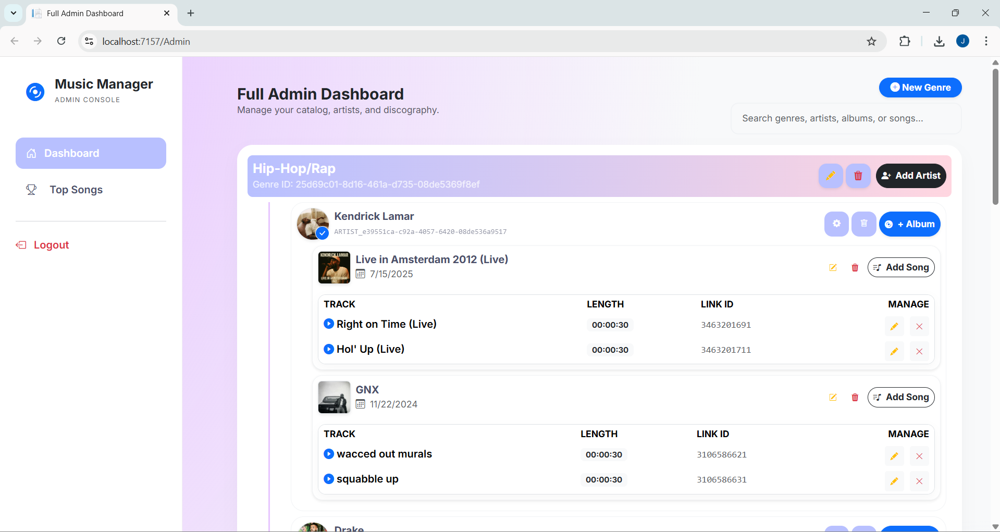
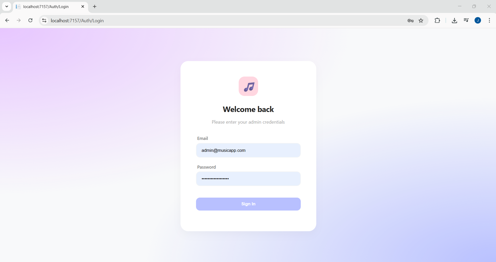
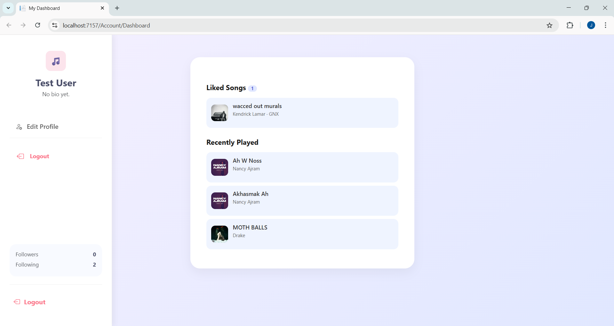
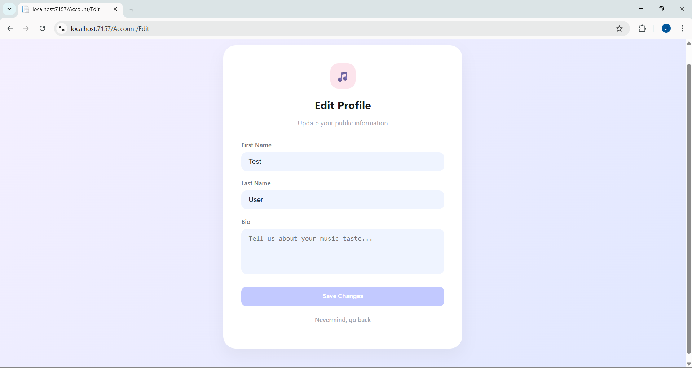
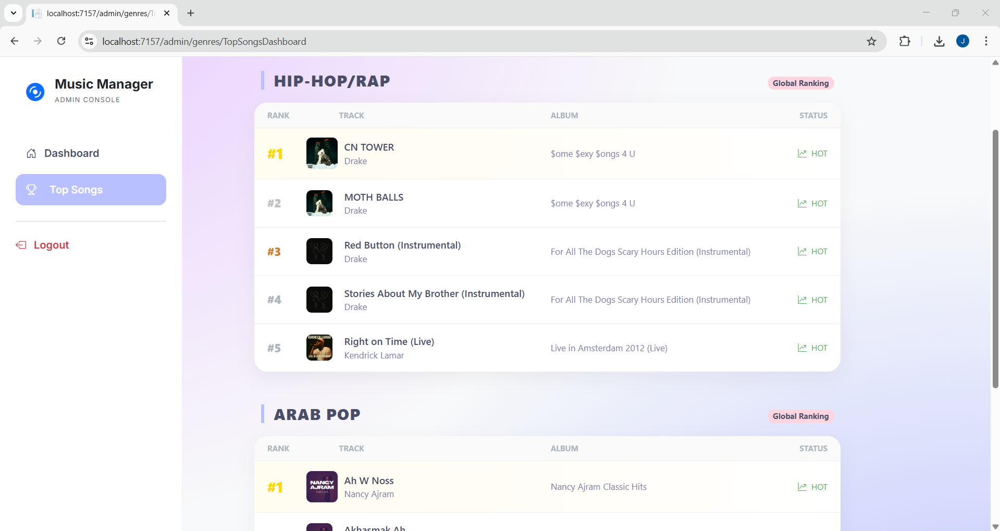

# Music App Backend

## Project Description
This project is a backend for a music streaming application. It provides **API endpoints** for music app functionality such as playing songs, liking songs, and following artists or playlists, designed to be consumed by a Flutter app.

It also includes **MVC web interfaces**:

- **Admin MVC:** Perform CRUD operations on genres, artists, albums, and tracks, and view top songs per genre.
- **User MVC:** View recently played and liked songs, and edit profile. (No registration implemented in MVC)

The project demonstrates the use of both **Entity Framework (EF)** for standard CRUD operations and **ADO.NET** for performance-critical actions like playing songs, liking songs, and following playlists.

---

## Features

### Admin MVC
- Manage genres, artists, albums, and tracks (CRUD)
- View top songs per genre

### User MVC
- View recently played songs
- View liked songs
- Edit profile

### API Endpoints (Key Examples)
- Play a song
- Like/unlike a song
- Follow/unfollow artists
- Follow/unfollow playlists
- Fetch current user’s liked songs and recently played songs
- Admin dashboard for managing artists, albums, songs, and genres

> Only the most important endpoints are listed here for clarity. Full API documentation is available in the code.

### Database Operations
- **Entity Framework (EF):** Most CRUD operations (genres, artists, albums, tracks, user profile)
- **ADO.NET:** Playing songs, liking songs, and following/unfollowing artists or playlists

---

## Technologies Used
- ASP.NET MVC 5
- Entity Framework Core (Code First)
- ADO.NET
- SQL Server 
- C# and .NET 8

---

## Project Structure
```
/mymusic-app
 ├─ /Controllers
 │   ├─ AlbumsController.cs
 │   ├─ ArtistController.cs
 │   ├─ AuthController.cs
 │   ├─ FeedController.cs
 │   ├─ HomeController.cs
 │   ├─ PlaylistController.cs
 │   ├─ SongsController.cs
 │   ├─ UserController.cs
 │   ├─ /Account
 │   │   └─ AccountController.cs
 │   └─ /Admin
 │       ├─ AdminController.cs
 │       └─ GenresController.cs
 │
 ├─ /Data
 │   ├─ AppDbContext.cs
 │   └─ AppDbContextFactory.cs
 │
 ├─ /DTOs
 │   └─ DTOs.cs
 │
 ├─ /Migrations
 │   └─ [EF migration files]
 │
 ├─ /Models
 │   ├─ Album.cs
 │   ├─ Artist.cs
 │   ├─ ArtistGenre.cs
 │   ├─ ErrorViewModel.cs
 │   ├─ Genre.cs
 │   ├─ Playlist.cs
 │   ├─ PlaylistFollow.cs
 │   ├─ PlaylistSong.cs
 │   ├─ Song.cs
 │   ├─ SongGenre.cs
 │   ├─ User.cs
 │   ├─ UserAlbumFollow.cs
 │   ├─ UserArtistFollow.cs
 │   ├─ UserFollow.cs
 │   ├─ UserSongLike.cs
 │   └─ UserSongPlay.cs
 │
 ├─ /Repositories
 │   ├─ AlbumRepository.cs / IAlbumRepository.cs
 │   ├─ ArtistRepository.cs / IArtistRepository.cs
 │   ├─ GenreRepository.cs / IGenreRepository.cs
 │   ├─ PlaybackRepository.cs / IPlaybackRepository.cs
 │   ├─ PlaylistRepository.cs / IPlaylistRepository.cs
 │   ├─ SongRepository.cs / ISongRepository.cs
 │   └─ UserRepository.cs / IUserRepository.cs
 │
 ├─ /Services
 │   ├─ AlbumService.cs / IAlbumService.cs
 │   ├─ ArtistService.cs / IArtistService.cs
 │   ├─ AuthService.cs / IAuthService.cs
 │   ├─ GenreService.cs / IGenreService.cs
 │   ├─ PlaylistService.cs / IPlaylistService.cs
 │   ├─ SongService.cs / ISongService.cs
 │   └─ UserService.cs / IUserService.cs
 │
 ├─ /Views
 │   ├─ /Account
 │   │   ├─ Dashboard.cshtml
 │   │   └─ Edit.cshtml
 │   ├─ /Admin
 │   │   └─ Index.cshtml
 │   ├─ /Auth
 │   │   ├─ AccessDenied.cshtml
 │   │   └─ Login.cshtml
 │   ├─ /Genres
 │   │   └─ TopSongsDashboard.cshtml
 │   ├─ /Home
 │   │   ├─ Index.cshtml
 │   │   └─ Privacy.cshtml
 │   └─ /Shared
 │       ├─ Error.cshtml
 │       ├─ _Layout.cshtml
 │       └─ _Sidebar.cshtml
 │
 └─ /wwwroot
     ├─ /css
     │   ├─ site.css
     │   └─ style.css
     └─ /js
         └─ site.js
```

---

## Screenshots / Demo

### Admin Dashboard


### Login Page


### User Dashboard


### Edit Profile


### Top Songs by Genre



---

## Database Setup
1. Update your connection string in `appsettings.json`.
2. Run Entity Framework migrations:
```bash
dotnet ef migrations add InitialCreate
dotnet ef database update
```
3. Seed initial data if required.

---

## How to Run
1. Clone the repository:
```bash
git clone <repo_url>
```
2. Open the solution in **Visual Studio**.
3. Build the solution.
4. Run the application (F5 or `dotnet run`).
5. Navigate to:
   - **Admin MVC:** `/Admin`
   - **User MVC:** `/Account/Dashboard`

---

